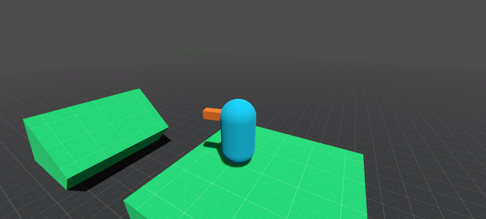
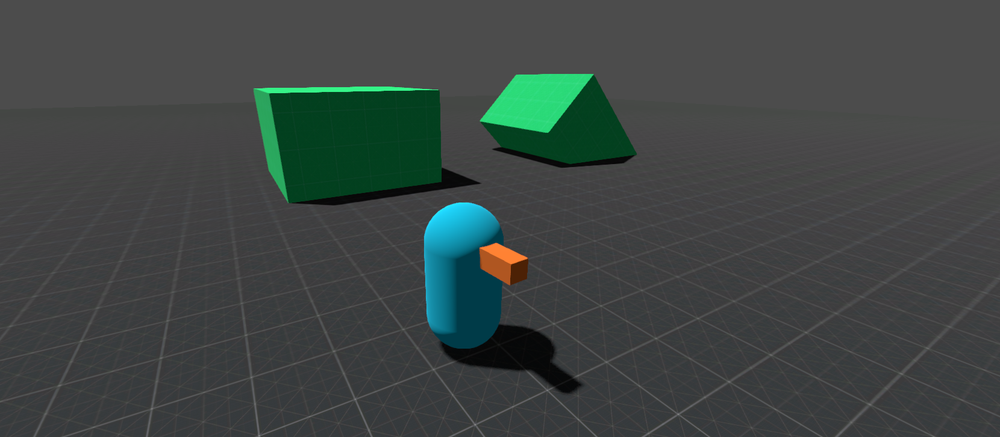

# Simples Controle em Terceira Pessoa

---

### Sobre

Uma simples implementação de um sistema de controle em terceira pessoa na godot engine. Este projeto foi desenvolvido seguindo o tutorial do canal **rayuse rp** no youtube. Link abaixo.

[How To Make A 3rd Person Controller With Full Gamepad Support | Godot 3.3](https://www.youtube.com/watch?v=dcCzKHTxflo&t=1385s)

Esta é uma versão simplificada do tutorial acima (não possui calculo de fricção, resistência do ar, entre outras coisas).

Diferentemente do tutorial, neste sistema você consegue rotacionar a câmera em torno do personagem sem move-lo.

Este sistema funciona utilizando o teclado e mouse e também um controle joystick.

